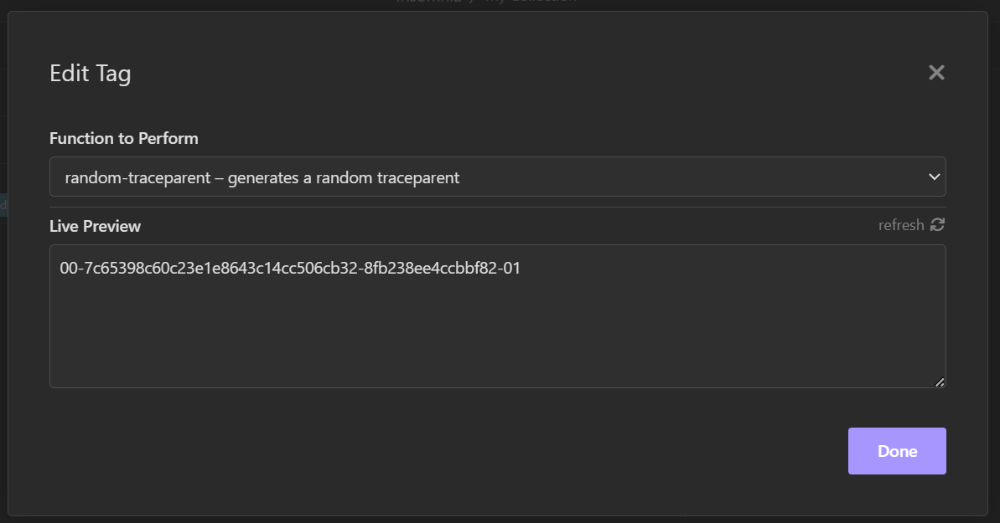
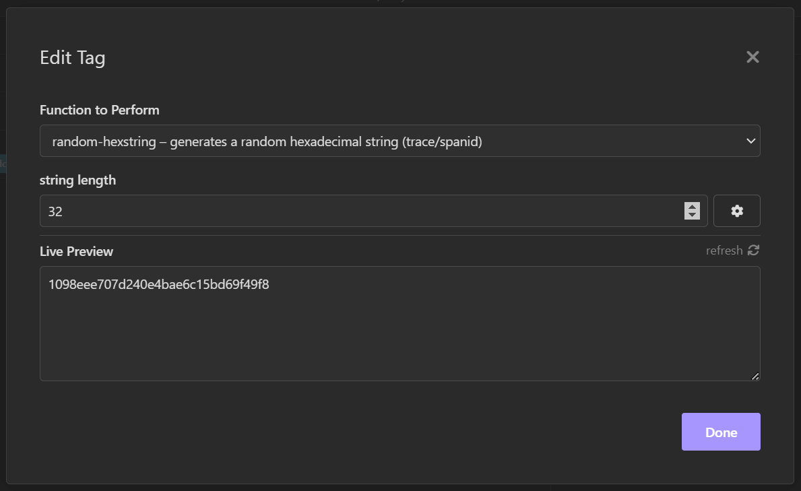

# id-inator

Insomnia plugin to generate traceparents and customer hexadecimal strings

## functions

### random-traceparent

generates a traceparent id that looks like `00-a6d8244074449746df8c2a61d3624c45-4d11ea8abbcdb7c0-01`

### random-hexstring

generates a random hexadecimal string that can be used for headers like `traceid`, `spanid`. Use the options to set the character length of the hex string.

